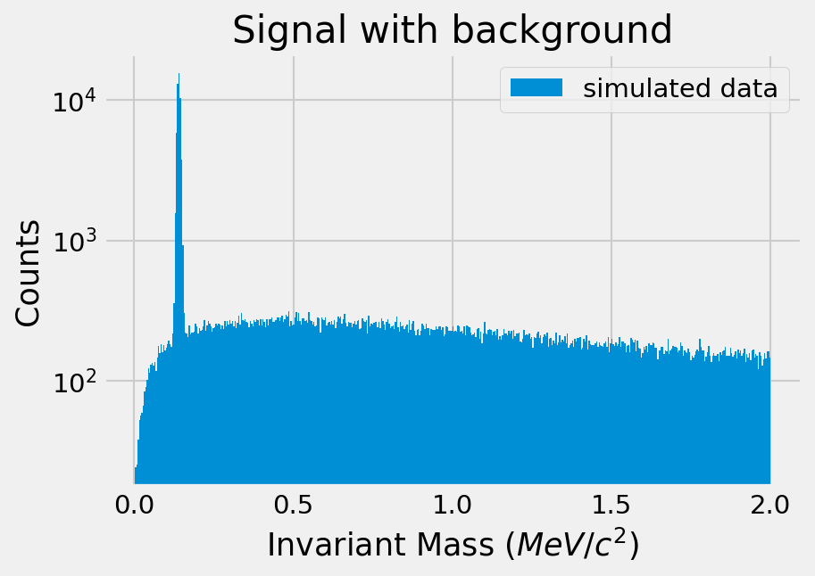

# Pion Rest Mass

Simulated the multiplicity and momentum distributions of neutral pions produced in pp collisions and reconstructed the invariant mass with a Monte Carlo simulation of its decay products

